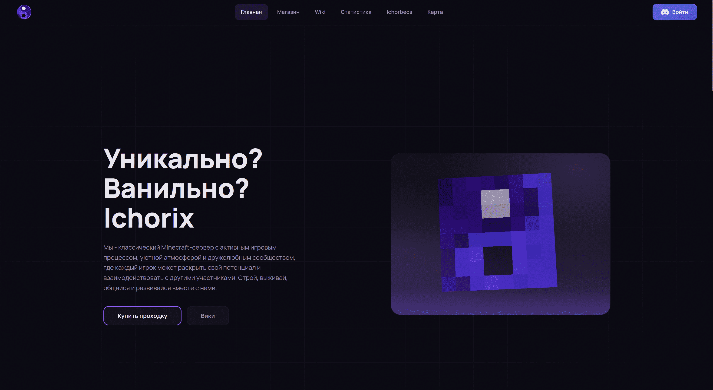
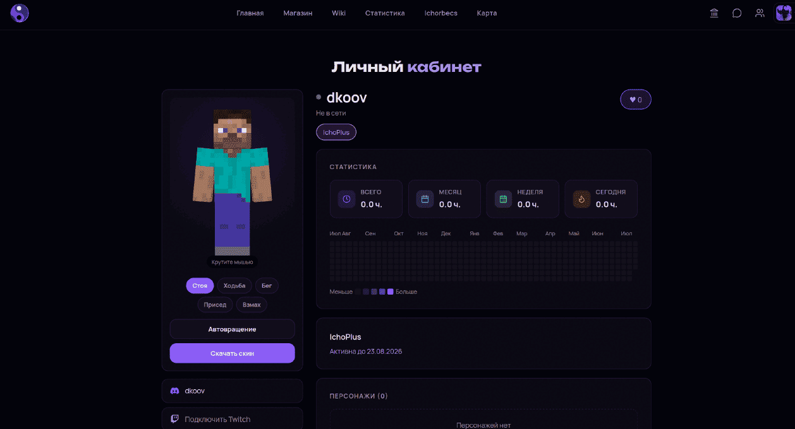
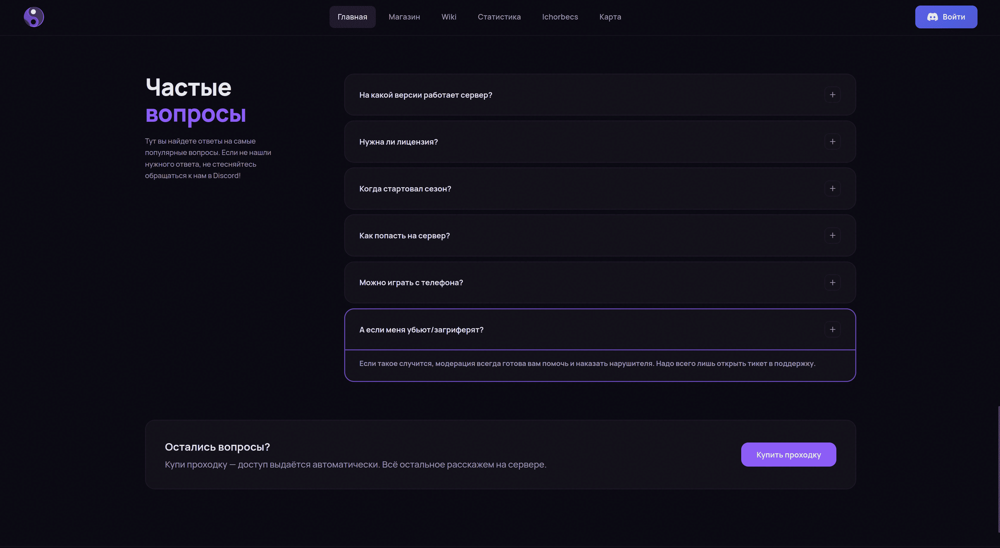
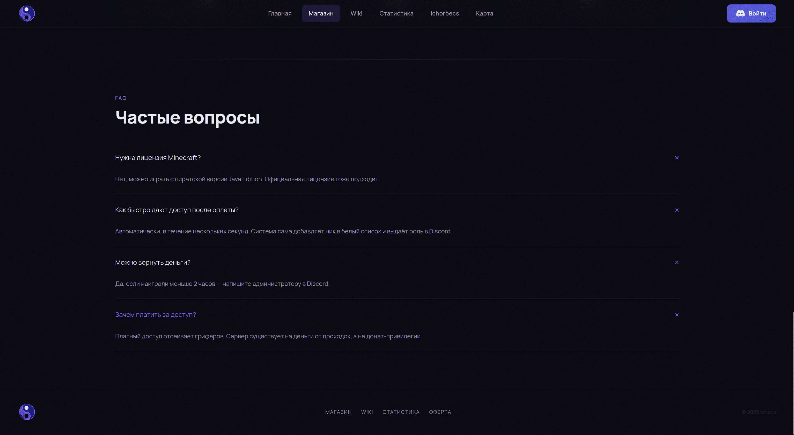
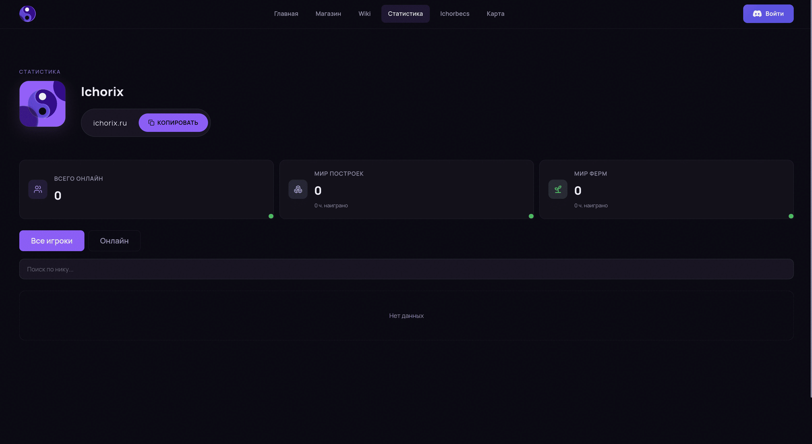
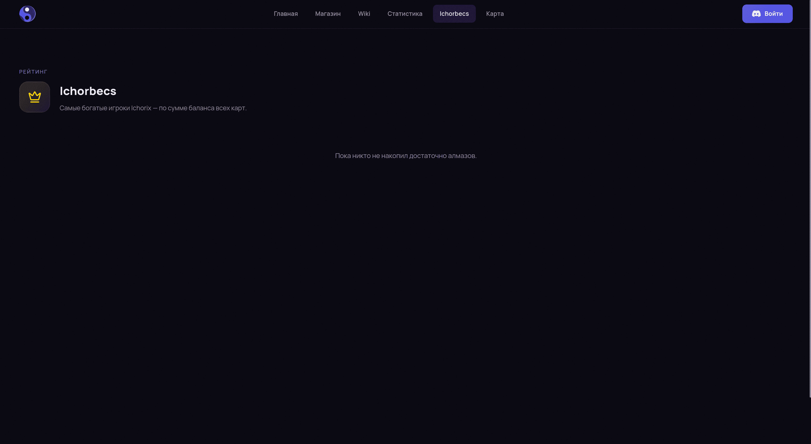

# Ichorix (ранее GryazWorld)

Сайт + бэкенд + Discord-боты + Spigot-плагин для сети Minecraft-серверов GryazWorld / Ichorix.

## Статус проекта

Проект остановлен в августе 2026 года: инфраструктура отключена, домены не обслуживаются, сайт недоступен. Репозиторий сохранён как архив разработки. Проект полностью поднимается локально — см. «Локальный запуск».

## Масштаб

- 123 эндпоинта REST API — 63 веб, 39 игровых, 15 внутренних для ботов
- 175 коммитов
- 5 сервисов в Docker Compose
- 5 компонентов: бэкенд, фронтенд, два Discord-бота, Minecraft-плагин

## Скриншоты

Главная страница:



Личный кабинет:



Магазин:



Вики:



Статистика:



Рейтинг богатства («Ичорбексы»):



## Стек

**Бэкенд** (`backend/requirements.txt`, Python 3.12 в Docker):
FastAPI 0.115.0, uvicorn[standard] 0.30.6, SQLAlchemy 2.0.35 (async),
aiosqlite 0.20.0, aiomysql 0.2.0, aiohttp 3.9.5, PyJWT 2.9.0,
yookassa 3.5.0, bleach 6.1.0, python-dotenv 1.0.1.
База — SQLite; MySQL (aiomysql) используется только для чтения внешней БД charsystem.

**Фронтенд** (`frontend/package.json`, Node 20 в Docker):
React 19.2, react-router-dom 7.13, Vite 8, framer-motion 12,
lucide-react 1.23, react-markdown 10 + remark-gfm 4,
three 0.185 с @react-three/fiber 9 и @react-three/drei 10, skinview3d 3.4.
ESLint 9.

**Плагин** (`minecraft-plugin-prod/pom.xml`, Java 21):
paper-api 1.21.1-R0.1-SNAPSHOT (provided), OkHttp 4.12.0, Gson 2.10.1,
maven-shade-plugin 3.5.0 с релокацией зависимостей.

**Боты**:
- `discord-bot/` — discord.py 2.3.2, aiohttp 3.9.5, python-dotenv 1.0.1.
- `discord-bot-main/` — discord.js 14.16, TypeScript через tsx 4.19,
  discord-html-transcripts 3.3, pnpm 10.28, Node 22 в Docker.

## Как всё связано

```
   Minecraft (Paper 1.21, плагин ServerPanel)
      │  ▲
      │  │ backend → плагин: /api/ban, /api/unban, /api/unmute,
      │  │ /api/whitelist/add  (HTTP-сервер внутри плагина, ban-api.port)
      │  │
      │  └ плагин → backend: /mc/*  (заголовок X-Plugin-Secret)
      ▼
 ┌─────────────────────────────┐        ┌──────────────────────────┐
 │  Backend (FastAPI, :8000)   │◄──────►│  charsystem (MySQL,      │
 │  SQLite serverpanel.db      │  чтение│  внешний игровой сервер) │
 └───┬───────────┬─────────┬───┘        └──────────────────────────┘
     │           │         │
     │ /web/*    │         │ POST /discord/notify
     │           │         ├──────────► discord-bot        (:5000)
     ▼           │         └──────────► discord-bot-main   (:5050)
 Frontend        │
 (React, nginx)  │  боты → backend: /internal/*  (заголовок X-Api-Key)
                 │
                 └──── ЮKassa: создание платежа, вебхук /web/payments/webhook
```

Фронтенд не ходит в бэкенд напрямую по адресу: в разработке запросы `/web/*` и `/mc/*`
проксирует dev-сервер Vite, в Docker — nginx внутри контейнера фронта.

## Возможности

Что реально реализовано в коде:

**Аккаунты**
- Вход через Discord OAuth, привязка ника Minecraft к Discord-аккаунту.
- Привязка Twitch (отдельный OAuth, отвязка).
- Сессия сайта — JWT (HS256, 7 дней) на `SESSION_SECRET`.
- Авторизация игрока в игре по IP: неизвестный IP → подтверждение через Discord-бота,
  IP-баны, срок жизни сессии.

**Профили и статистика**
- Публичный профиль игрока: ник, скин, роли, наигранное время, варны, лайки.
- Учёт времени по дням и отдельно по каждому серверу сети.
- Общая статистика сервера, онлайн, рейтинг богатства («Ичорбексы»).
- Отдача скина и головы игрока через бэкенд.

**Банк**
- Несколько счетов у игрока, основной счёт, свои названия и картинки карт.
- Переводы между игроками и между счетами, история транзакций.
- Выдача доступа к своему счёту другому игроку.
- Счета к оплате: выставить, оплатить, отклонить.
- В игре: банкоматы (`/setatm`, `/unsetatm`), меню `/bank`, админ-команда `/adminbank`.

**Штрафы, варны, суд**
- Выдача штрафа и варна из игры (`/fine`, `/warn`, `/unwarn`), дедлайн оплаты.
- Оплата штрафа с банковского счёта — из игры и с сайта.
- Крон помечает просроченные штрафы; плагин периодически проверяет их у игроков.
- Иски: подача через Discord, рассмотрение на странице «Суд»,
  одобрение с выпиской штрафа или отклонение.

**Сообщество**
- Общины: создание, описание блоками, баннер, теги, приватность, набор участников,
  роли внутри общины, приглашения (в том числе командой `/invite` в игре), кик, выход.
- Личные сообщения между игроками: сайт ↔ игра, отметка о доставке в игру.
- Голосования: с сайта и из игры, дедлайн с автозакрытием, объявление победителя.

**Магазин и оплата**
- Каталог на стороне бэкенда (`products.py`): разбан, размут, разварн,
  сезонная проходка, подписка IchoPlus на 1/2/3 месяца.
- Оплата через ЮKassa, вебхук с проверкой IP по whitelist, заказы и платежи в БД.
- Очередь доставки (`delivery_tasks`): если плагин, бот или charsystem недоступны,
  выдача повторяется кроном с ограничением по числу попыток.
- Подписки с окончанием срока — крон снимает истёкшие.

**Служебное**
- `/internal/*` для ботов (ключ `X-Api-Key`): whitelist, смена ника,
  проверка сессии, IP-баны, наигранное время, синхронизация ролей Discord.
- Игровые роли берутся из внешней БД charsystem (MySQL); если игрок ещё ни разу
  не заходил, роль запоминается и выдаётся при первом входе.
- Античит: алерты о добыче алмазов уходят в Discord.
- Порталы между серверами сети: регистрация, поиск ближайшего, телепорт.
- Сборка ресурс-пака со звуком: загрузка аудио, конвертация ffmpeg в ogg,
  пересборка `pack.zip` и sha1.
- Безопасность: заголовки HSTS/CSP/X-Frame-Options, защита от CSRF по Origin/Referer,
  ограничение частоты запросов по префиксам путей.

Страница «Карта» — iframe на внешний рендер карты (`/map/gamegraz/`, `/map/farmgame/`),
самого рендера в репозитории нет.

## Структура проекта

```
backend/                    — API-сервер (Python, FastAPI)
  main.py                   — приложение, middleware (CORS, CSP, CSRF, rate limit), /health
  database.py               — модели SQLAlchemy и инициализация БД
  auth.py                   — X-Plugin-Secret для плагина, JWT-сессии веб-кабинета
  cron.py                   — фоновые задачи: подписки, голосования, штрафы, очередь доставки
  products.py               — серверный каталог товаров (цены с фронта не принимаются)
  yookassa_client.py        — инициализация SDK ЮKassa + whitelist IP для вебхука
  charsystem_client.py      — доступ к игровой БД charsystem (MySQL) за игровыми ролями
  routers/
    player.py               — вход/выход/смерть/чат, античит, авторизация по IP
    bank.py                 — банк со стороны игры (банкоматы, переводы, оплата штрафов)
    bank_web.py             — банк со стороны сайта (счета, доступы, счета к оплате)
    fines.py                — штрафы и варны
    court.py                — иски и их рассмотрение
    web.py                  — кабинет, профили, статистика, общины, скины
    admin.py                — админка сайта (роли, подписки, карты)
    messenger.py            — личные сообщения сайт ↔ игра
    polls.py                — голосования (веб, админка, игра)
    payments.py             — заказы, оплата через ЮKassa, вебхук
    portals.py              — порталы между серверами сети
    soundpack.py            — сборка ресурс-пака со звуком
    internal.py             — служебный API для ботов (whitelist, авторизация, IP-баны)
frontend/                   — сайт (React 19 + Vite, сборка отдаётся nginx)
  src/pages/                — страницы: главная, магазин, вики, статистика, банк,
                              суд, кабинет, общины, мессенджер, голосования, карта, админка
  src/components/           — общие компоненты, включая 3D-просмотр скина
  nginx.conf                — конфиг nginx внутри контейнера фронта (проксирует API на backend)
discord-bot/                — бот уведомлений (Python, discord.py), вебхук на порту 5000
discord-bot-main/           — основной бот (TypeScript, discord.js): заявки, тикеты,
                              суд, whitelist, синхронизация ролей, релей чата
minecraft-plugin-prod/      — Spigot/Paper-плагин ServerPanel (Java 21, Maven)
nginx/                      — конфиг nginx для хост-машины (деплой без Docker)
scripts/backup.sh           — бэкап SQLite
docs/screenshots/           — скриншоты интерфейса
docker-compose.yml          — сборка и запуск всех сервисов
```

## Локальный запуск

### Требования

- **Python 3.10+** (в Docker используется 3.12)
- **Node.js 20+** и **npm** (Vite 8 не работает на Node 18)

```bash
python3 --version
node --version
```

Быстрый вариант — `make install` и `make run` в корне: поднимет и бэкенд, и фронт.
Ниже то же самое вручную.

### 1. Бэкенд

```bash
cd backend

python3 -m venv .venv
source .venv/bin/activate        # Linux / Mac
# .venv\Scripts\activate         # Windows

pip install -r requirements.txt

# Взять шаблон и заполнить
cp .env.example .env
```

Что в `backend/.env.example` и что с этим делать локально:

| Переменная | Нужна для | Локально |
|---|---|---|
| `DISCORD_CLIENT_ID`, `DISCORD_CLIENT_SECRET` | вход через Discord | из Developer Portal |
| `DISCORD_REDIRECT_URI` | вход через Discord | `http://localhost:5173/cabinet` |
| `TWITCH_CLIENT_ID`, `TWITCH_CLIENT_SECRET`, `TWITCH_REDIRECT_URI` | привязка Twitch | можно оставить пустыми |
| `PLUGIN_SECRET` | запросы плагина к `/mc/*` | любая строка, та же в config.yml плагина |
| `SESSION_SECRET` | JWT-сессии кабинета | обязательно: без него `/web/me` отдаёт 500 |
| `DATABASE_URL` | база | `sqlite+aiosqlite:///./serverpanel.db` |
| `MC_SERVER_HOST`, `MC_SERVER_PORT` | пинг сервера, адрес плагина | как есть |
| `YOOKASSA_SHOP_ID`, `YOOKASSA_SECRET_KEY`, `YOOKASSA_RETURN_URL` | оплата | без них падает только создание платежа |

Ключ для `SESSION_SECRET`:

```bash
python -c "import secrets; print(secrets.token_urlsafe(48))"
```

Эти переменные читаются кодом, но в `.env.example` их нет — локально не нужны,
на проде задавать:

- `DISCORD_BOT_URL` — куда крон шлёт уведомления боту;
- `MC_BAN_PORT` — порт HTTP-сервера внутри плагина (по умолчанию 8080);
- `DISCORD_BOT_TOKEN`, `DISCORD_GUILD_ID` — чтение ролей Discord;
- `DISCORD_AUTH_API_KEY` — ключ для `/internal/*`, без него весь раздел отдаёт 403;
- `AUTH_BOT_URL` — адрес бота авторизации (по умолчанию `http://discord-bot-auth:5001`);
- `CHARSYSTEM_MYSQL_HOST/PORT/USER/PASSWORD/DB` — внешняя БД игровых ролей.
  Значения по умолчанию указывают на боевой сервер; локально он недоступен,
  бэкенд это переживает — роли просто не показываются.

Запуск:

```bash
uvicorn main:app --reload --port 8000
```

Проверка: `http://localhost:8000/health` — `{"status":"ok"}`

### 2. Фронтенд

В новом терминале:

```bash
cd frontend
cp .env.example .env
npm install
npm run dev
```

В `frontend/.env`:

- `VITE_DISCORD_CLIENT_ID` — тот же client id, что в бэкенде;
- `VITE_TWITCH_CLIENT_ID` — можно оставить пустым;
- `VITE_REDIRECT_URI` — для локального запуска `http://localhost:5173/cabinet`;
  должен совпадать с `DISCORD_REDIRECT_URI` бэкенда, иначе OAuth не сойдётся.
  Если переменную не задать, подставится боевой `https://ichorix.cc/cabinet`.
- `VITE_API_URL` — в `.env.example` его нет, но код его читает. Пустое значение
  (по умолчанию) означает «относительные пути», то есть через прокси Vite — так и надо локально.

Сайт: `http://localhost:5173`. Запросы `/web/*` и `/mc/*` проксируются на бэкенд автоматически
(`vite.config.js`, цель `http://localhost:8000`).

### 3. Discord-бот (опционально)

```bash
cd discord-bot
cp .env.example .env
pip install -r requirements.txt
python bot.py
```

Переменные: `BOT_TOKEN`, `GUILD_ID`, `FINES_CHANNEL_ID`, `EVENTS_CHANNEL_ID`,
`BACKEND_URL` (локально `http://localhost:8000`), `API_SECRET`, `WEBHOOK_PORT` (5000).

Второй бот, `discord-bot-main/`, локально обычно не нужен: у него нет `.env.example`,
а требует он около тридцати переменных — токен, id гильдии и id каналов и ролей
(заявки, суд, тикеты, стафф, голосования, релей чата), плюс `INTERNAL_API_KEY`
и `PLUGIN_SECRET` для похода в `/internal/*`. Запуск — `pnpm start`.

Инструкция по развёртыванию на сервере — [docs/DEPLOY.md](docs/DEPLOY.md).

## Что бы сделал иначе

**SQLite вместо PostgreSQL.** Выбрал на старте за простоту деплоя — один файл, никакой отдельной СУБД. С ростом числа таблиц и одновременных запросов от плагина, сайта и ботов ограничения на параллельную запись стали заметны. Для системы с платежами и постоянной синхронизацией из игры правильнее было брать PostgreSQL сразу.

**Автопуш кроном как костыль для чужих правок.** Часть работ на сервере вёл другой участник команды — без доступа к репозиторию и без опыта работы с git, правя файлы напрямую на проде. Каждый мой деплой давал конфликты, а его правки терялись. Решил автоматическим коммитом с сервера в отдельную ветку раз в 30 минут: правки перестали пропадать, а вливал я их уже осознанно через мерж. Костыль сработал, но правильное решение было другим — дать человеку доступ к репозиторию и потратить час на объяснение трёх команд.

**Три Discord-бота вместо одного.** Сложилось исторически: один бот перешёл вместе с купленным проектом, второй писался под свои задачи, третий отвечал за авторизацию. В итоге три отдельных сервиса, три конфига и три точки отказа там, где хватило бы одного. У одного из них к тому же не осталось исходников в репозитории — он собирался из локального образа, что делает воспроизводимость деплоя неполной.

**Переменные окружения без единого источника правды.** Часть переменных код читает, но их нет в `.env.example` — это всплыло только при попытке поднять проект с нуля. Стоило вести схему конфигурации в одном месте и валидировать её при старте приложения.

